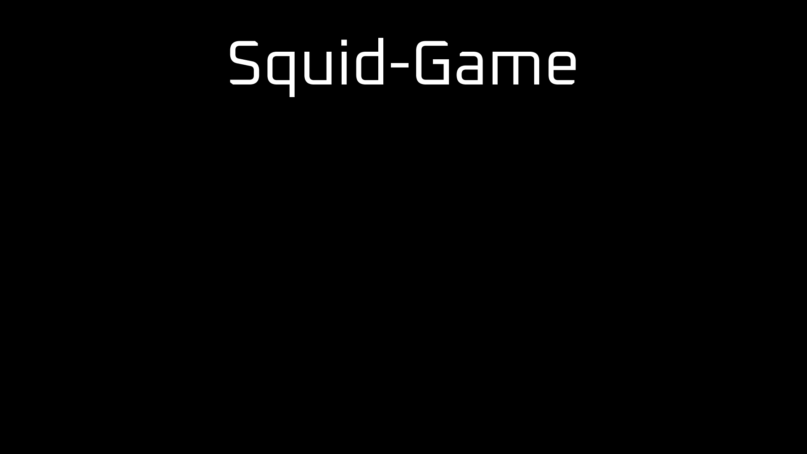

<h1 align="center">Squid-Game</h1>

Projeto desenvolvido baseado no workshop do canal DEVEMDOBRO.

 

  

##  Tecnologias

Esse projeto foi desenvolvido com as seguintes tecnologias:

- HTML e CSS
- JavaScript
- Git e Github
- Figma

## Projeto

Você pode visualizar o projeto --> [aqui](https://thayane25.github.io/Squid-Game/) 

## Layout

Você pode visualizar o layout do projeto original através [DESSE LINK](https://www.figma.com/community/file/1187422022288947321). 
